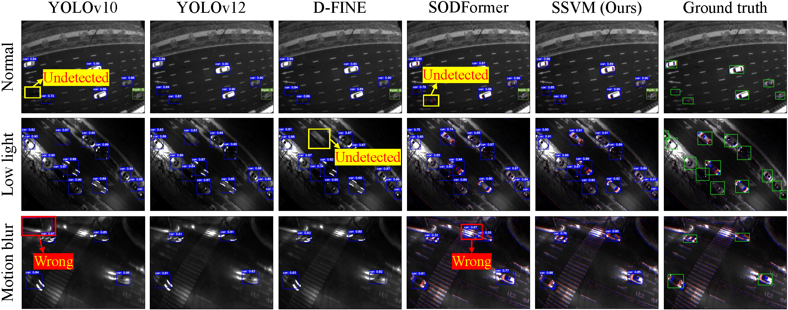

# SSVM
Streaming State Vision Model



Comparison with other state-of-the-art methods

## Table of Contents
-  EMRS Dataset
-  Conda Installation
-  Demo
-  Copyright
### EMRS Dataset

The [EMRS Dataset](https://pan.baidu.com/s/1G30vw2NO3WvHO5Q2EViI6g) can be downloaded from Baidu Netdisk. 

```
EMRS
├── train/
│  ├── images/
│  │  ├── normal/
│  │  │  ├── 0001_normal/
│  │  │  │  ├── 0001_normal_001.png
│  │  │  │  ├── 0001_normal_002.png
│  │  │  │  ├── ...
│  │  │  │  └── 0001_normal_100.png
│  │  │  ├── 0002_normal/
│  │  │  ├── ...
│  │  │  └── 0076_normal/
│  │  ├── low_light/
│  │  └── motion_blur/
│  ├── events/
│  │  ├── normal/
│  │  ├── low_light/
│  │  └── motion_blur/
│  └── labels/
│     ├── normal/
│     ├── low_light/
│     └── motion_blur/
└── val/
```


### Conda Installation
We train our models under`python=3.8,pytorch=2.2.2,cuda=11.8`. 

####  1. Install Pytorch and torchvision.
Follow the instruction on  [https://pytorch.org/get-started/locally/](https://pytorch.org/get-started/locally/).

`conda install -c pytorch pytorch torchvision`

####  2. Install other needed packages
   
`pip install -r requirements.txt`

####  3. For more detailed installation steps, please refer to [Ultralytics](https://github.com/ultralytics/ultralytics)


### Demo

train script 
```sh
python main.py --model_cfg "cfg/smvm-s.yaml" --dataset_path "dataset_path" --multimodal "image"
```

val script 
```sh
python main.py --model_cfg "cfg/smvm-s.yaml" --dataset_path "dataset_path" --multimodal "image"  --test_only True --resume "weight_path"
```

### Copyright Notice

This project is licensed under the MIT License. For details, please see [LICENSE.txt](https://github.com/shaojintian/Best_README_template/blob/master/LICENSE.txt)


